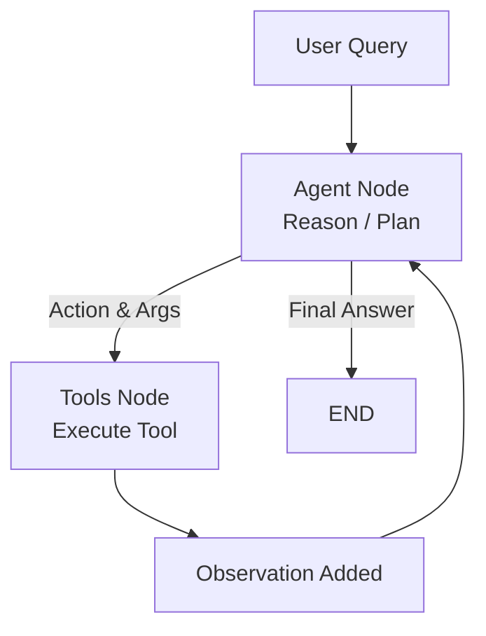

# 🧩 ReAct Agent Framework – From Scratch to Full System

This repository demonstrates how to **build and visualize ReAct Agents** — step by step — using **LangGraph** and **LangChain**.  
It contains progressively richer notebooks that reveal the evolution from a simple LLM reasoning loop to a structured **Reason–Act–Observe** system capable of using external tools.

---

## 📁 Repository Contents

| Notebook | Purpose |
|-----------|----------|
| **ReAct_from_scratch.ipynb** | Implements the ReAct pattern manually — shows how an LLM can perform *Thought → Action → Observation → Answer* loops without external frameworks. |
| **ReAct_Agent_with_Framework.ipynb** | Translates the same logic into a **LangGraph-based StateGraph**, wiring the reasoning and tool-calling pipeline. |
| **ReActChatbot.ipynb** | Wraps the ReAct agent into an interactive chatbot demo, demonstrating conversational state retention and reasoning transparency. |

---

## ⚙️ Setup Instructions

### 1. Clone or download
```bash
git clone <repo-url>
cd react-agent-framework
```

### 2. Create environment
```bash
pip install -r requirements.txt
```

If `requirements.txt` is missing, install manually:
```bash
pip install langchain langgraph langchain-openai ipywidgets jupyter
```

### 3. Configure API key
Before running any notebook, set your OpenAI API key:
```python
import os
os.environ["OPENAI_API_KEY"] = "sk-your-key"
```

---

## 🚀 Run the Notebooks

1. Open Jupyter or VSCode Notebook interface.  
2. Start with **ReAct_from_scratch.ipynb** to understand the low-level loop.  
3. Move to **ReAct_Agent_with_Framework.ipynb** to see how LangGraph automates orchestration.  
4. Finally, explore **ReActChatbot.ipynb** to interact with the agent conversationally.

---

## 🧠 Conceptual Overview

### What is ReAct?
**ReAct** (Reason + Act) is a prompting and architectural pattern where an LLM alternates between reasoning and acting steps:

```
THOUGHT → ACTION → OBSERVATION → ANSWER
```

This pattern enables **grounded intelligence** — the agent doesn’t hallucinate answers; it reasons, acts via tools, and verifies observations.

### Why LangGraph?
LangGraph allows you to represent ReAct’s reasoning loops as **graphs**, connecting nodes like:
- `agent` → reasoning node (LLM call)
- `tools` → execution node (Python tool or API call)
- `should_continue` → controller node (loop stop condition)

---

## 🧩 Example Query Flow

```
User: My weight is 72 kg and my height is 1.75 m. What is my BMI and water intake?

→ Agent (THOUGHT): I need to call calculate_bmi first.
→ ACTION: calculate_bmi({ "weight_kg": 72, "height_m": 1.75 })
→ OBSERVATION: 23.51

→ Agent (THOUGHT): Now call daily_water_intake.
→ ACTION: daily_water_intake({ "weight_kg": 72 })
→ OBSERVATION: 2.52

→ ANSWER: Your BMI is 23.5, and you should drink ~2.5L water daily.
```

---

## 🧩 Architecture Diagram



---

## 🧠 Learning Goals

By the end of these notebooks, you will:
- Understand how ReAct bridges LLM reasoning with tool execution.
- Learn how LangGraph manages **agent state transitions**.
- Build your own **domain-specific agent** (e.g., finance, healthcare, travel).

---

## 🧩 Extensions You Can Try

- Add a **new tool** (e.g., weather lookup, stock data).  
- Introduce **reflection nodes** (critic agent reviews actions).  
- Visualize **graph recursion traces** for debugging.  
- Deploy the chatbot as a Streamlit app.

---

## 🏁 Credits

Created for educational demonstration of **Agentic AI Systems**.  
Concepts inspired by ReAct (Yao et al., 2022) and LangGraph by LangChain.  
Author: *Dr. Praveen Kumar Pokala*

---

> “ReAct is not just prompting — it’s how an LLM learns to think in public.” 🧠
